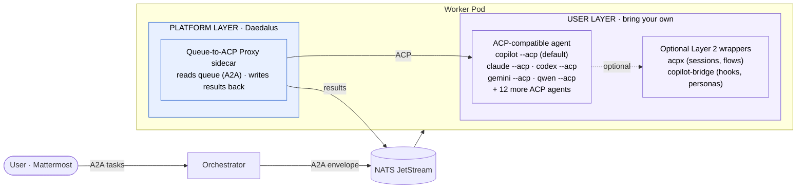

# Daedalus

Kubernetes-native agent orchestration platform. Named after the master builder of Greek mythology - the architect who designed complex systems and created autonomous workers. Dispatches work to ephemeral AI agent workers via message queues, using the [A2A protocol](https://a2a-protocol.org/) for structured communication and [KEDA](https://keda.sh/) for elastic scaling.

**Runtime-agnostic by design.** The platform provides queue dispatch, scaling, discovery, and observability. Users bring their own agent runtime - copilot-bridge, kagent ADK, LangGraph, CrewAI, or any container that speaks A2A HTTP.

## Architecture (TL;DR)



**Key design decisions:**
- **ACP intra-pod** - proxy drives agent via Agent Client Protocol (the LSP of agents). 17+ agent CLIs already support it.
- **A2A inter-agent** - orchestrator dispatches tasks using A2A protocol via NATS queue. Standardized discovery, task lifecycle, capabilities.
- **Queue for decoupling** - NATS JetStream provides buffering, retry, scale-to-zero.
- **Pluggable agent runtime** - any ACP-compatible CLI works. Layer 2 wrappers (copilot-bridge, acpx) are optional.
- **Helm + KEDA for deployment** - workers scale 0-to-N based on queue depth.

## Repository Structure

```
research/           # Architecture research papers (from dark-factory)
docs/               # Planning and tracking documents
  plan.md           # Implementation plan and phase breakdown
  architecture-layers.md  # Four-layer model, ACP vs A2A, protocol map
  comparison-kagent.md    # Comparison with kagent (Solo.io)
cmd/
  proxy/            # Queue-to-ACP proxy sidecar (Go)
deploy/
  helm/             # Helm chart for factory deployment
  docker/           # Dockerfiles for proxy + agent containers
```

## Research

This project builds on extensive research conducted in [raykao/dark-factory](https://github.com/raykao/dark-factory):

| Paper | Topic |
|-------|-------|
| [Hybrid Comms Architecture](research/hybrid-comms-architecture.md) | A2A + queue + proxy pattern, AgentCard discovery, session state, risk register |
| [Dark Factory Architecture](research/dark-software-factory-architecture.md) | Vision, manufacturing analogy, component deep dive |
| [Containerizing Agent Runtimes](research/containerizing-agent-runtimes.md) | Three runtime models, hybrid recommendation |
| [Inter-Agent Task Handoff](research/inter-agent-task-handoff.md) | Async delegation, delegate_task design |
| [Message Broker Selection](research/message-broker-selection.md) | NATS JetStream recommendation |
| [KEDA ScaledJob Patterns](research/keda-scaledjob-patterns.md) | Scaling primitives, queue-driven autoscaling |

## Status

**Phase 0** - Planning and validation. See [docs/plan.md](docs/plan.md) for the implementation roadmap.

## Related

- [raykao/dark-factory](https://github.com/raykao/dark-factory) - Agent harness, research, and workspace conventions
- [A2A Protocol](https://a2a-protocol.org/) - Agent-to-Agent communication standard
- [copilot-bridge](https://github.com/ChrisRomp/copilot-bridge) - Chat platform bridge for GitHub Copilot
- [KEDA](https://keda.sh/) - Kubernetes Event Driven Autoscaling
