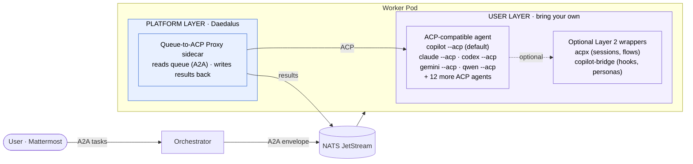

# Daedalus

> Kubernetes-native agent orchestration platform - dispatches work to ephemeral AI agent workers via message queues, using the [A2A protocol](https://a2a-protocol.org/) for structured communication and [KEDA](https://keda.sh/) for elastic scaling.

## What is Daedalus?

Daedalus is the platform layer for running AI agents as Kubernetes-native workloads. It provides queue-based task dispatch, KEDA-driven autoscaling, agent discovery, and observability - and stays runtime-agnostic. Bring your own agent: any ACP-compatible CLI (Copilot, Claude, Codex, Gemini, Qwen, and a dozen more) drops in unmodified. The platform handles the boring parts (queueing, scaling, tracing, retries) so the agent layer can focus on the work.

## Explore

- :material-rocket-launch: **Getting Started**

    Stand up Daedalus on AKS in under an hour.

    [:octicons-arrow-right-24: Deploy on AKS](aks-deployment.md)

- :material-sitemap: **Architecture**

    The four-layer model, ACP vs A2A, and the runtime contract.

    [:octicons-arrow-right-24: Layered Model](architecture-layers.md)

- :material-tools: **Operations**

    Runbooks, observability, alerts, SIGTERM behavior.

    [:octicons-arrow-right-24: Runbook](runbook.md)

- :fontawesome-brands-github: **Source**

    Issues, PRs, and roadmap on GitHub.

    [:octicons-arrow-right-24: raykao/daedalus](https://github.com/raykao/daedalus)

